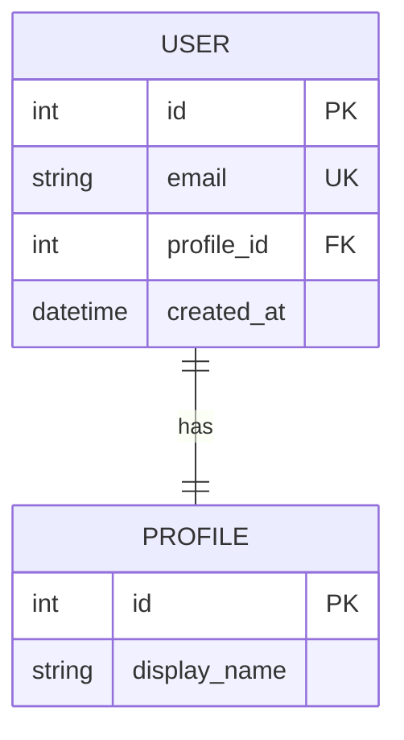
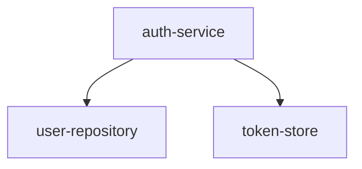
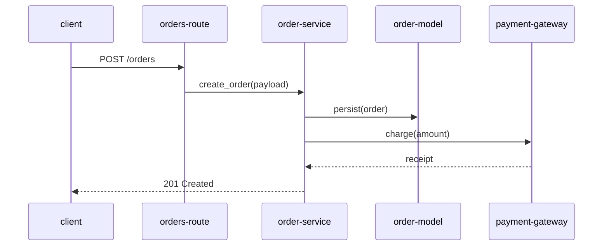

# Handoff Diagram Methodology & Business Document Catalogue

Read this file before generating any diagrams or business documents during `/handoff-start`. All rules are normative — follow them exactly.

---

## Part 1 — Diagram Decision Matrix

For each section you are documenting, classify it into one of the five categories below. Then generate diagrams according to the "Required" and "Optional" columns.

**Required**: Generate unconditionally for this section category — no code evidence check needed.

**Optional**: Generate only when clear code evidence exists (see evidence thresholds in § 1.2).

| Section Category | Required Diagrams | Optional Diagrams |
|---|---|---|
| Multi-component module (2+ interacting classes or services in the section) | Architecture overview (`flowchart TD`) | Sequence diagram (`sequenceDiagram`) — if async calls, event emissions, or message passing are present |
| Data layer (models, schemas, ORM, database access) | Entity-relationship (`erDiagram`) | Data flow (`flowchart LR`) — if data is transformed across multiple steps |
| Pipeline / event flow (queues, streams, webhooks, background jobs) | Data flow (`flowchart LR`) | Sequence diagram (`sequenceDiagram`) — if specific ordering of events matters |
| Single utility / pure function module | None | None |
| Entry point / orchestrator (startup scripts, main CLI, top-level routers) | Architecture overview (`flowchart TD`) | Sequence diagram (`sequenceDiagram`) — if the startup sequence has more than 3 steps |

### 1.1 — How to classify a section

Apply the first matching rule:

1. If the section reads from or writes to a database, defines models or schemas, or uses an ORM → **Data layer**
2. If the section uses queues, streams, webhooks, cron jobs, or background workers → **Pipeline / event flow**
3. If the section is named "main", "app", "server", "cli", "entrypoint", "bootstrap", "startup", or equivalent → **Entry point / orchestrator**
4. If the section contains 2 or more classes or services that call each other → **Multi-component module**
5. If the section contains a single exported function, a set of pure helper functions, or a single class with no inter-service calls → **Single utility / pure function module**

When a section matches multiple categories, apply the first matching rule in this list.

### 1.2 — Evidence thresholds for optional diagrams

Before generating an optional diagram, verify the evidence threshold is met:

- **Sequence diagram** (optional): Evidence threshold = at least one async call (`async/await`, `.then()`, callbacks, event emitters, message broker publish/subscribe), OR a multi-step interaction between two distinct actors visible in the code.
- **Data flow diagram** (optional): Evidence threshold = data is read from one source, transformed in at least 2 steps, then written to a different destination.

If the evidence threshold is not met, skip the optional diagram. Do not force diagrams on sections that do not benefit from them.

---

## Part 2 — Diagram Authoring Rules

### 2.1 — Mermaid syntax types

Use only the following Mermaid types:

| Diagram type | Mermaid keyword | When to use |
|---|---|---|
| Architecture overview | `flowchart TD` | Top-down box-and-arrow showing components and their relationships |
| Data flow | `flowchart LR` | Left-to-right flow showing data movement between stages |
| Sequence diagram | `sequenceDiagram` | Ordered message exchanges between actors |
| Entity-relationship | `erDiagram` | Data model with entities, attributes, and relationships |

Do not use other Mermaid types (`gantt`, `pie`, `gitGraph`, `classDiagram`, etc.) — they are not supported by the extension renderer in this version.

#### 2.1.1 — Field-level `erDiagram` authoring (data-layer domains)

When generating an `erDiagram` for a data-layer domain, make it **field-level, not box-level**. Each entity block must list its actual fields with types and key markers:



Rules:
- List each entity's fields as `<type> <name>` lines inside the entity block. Mark keys with `PK` (primary key), `FK` (foreign key), and `UK` (unique key).
- Show foreign-key relationships between entities with the correct cardinality (`||--||`, `||--o{`, `}o--o{`, etc.).
- Derive fields and types from the ORM model definitions, SQL DDL/schema files, or migration files.
- **Entities with more than 15 fields**: show only the most significant fields (primary key, foreign keys, unique keys, and business-critical columns) in the diagram, and note the total field count in the node's `## Technical Context` prose (e.g., "USER has 23 fields; key columns shown").

The data-layer node's `## Technical Context` prose must also list foreign keys, unique constraints, and notable indexes, and reference schema-shaping migrations (table creation, significant alterations) when migrations exist. These are factual transcriptions from the schema source and do not require citations.

### 2.2 — Diagram element naming

Use descriptive, stable labels for diagram elements. Labels should reflect the component's name as it appears in the codebase (class name, module name, service name). Use lowercase-hyphen format for multi-word labels. These labels are for diagram readability only — they are not used for navigation wiring.

- Lowercase all characters
- Replace spaces and underscores with hyphens
- Remove any characters that are not lowercase letters, digits, or hyphens
- Maximum 40 characters
- Examples: `AuthService` → `auth-service`, `UserRepository` → `user-repository`, `payment-gateway` → `payment-gateway`

Example diagram element labels:



### 2.3 — Diagram block structure

Each diagram block in the `## Diagrams` section must follow this exact structure:

```
### <Diagram Title>
<One sentence describing what this diagram shows.>

```mermaid
<mermaid source>
```
```

- The H3 title must be descriptive (e.g., "Authentication Service Architecture", not "Diagram 1")
- The description sentence must be plain language and stand alone without the diagram
- The fenced code block must open with ` ```mermaid ` on its own line and close with ` ``` ` on its own line

### 2.4 — Diagram validation procedure

After drafting a diagram, self-validate the Mermaid source before saving:

1. **Check for unclosed brackets or parentheses**: Scan the source for every `[`, `(`, `{`, `"` — verify each has a matching closing character.
2. **Check keyword correctness**: The first non-whitespace line of the source must be a valid Mermaid graph type keyword (`flowchart`, `sequenceDiagram`, `erDiagram`).
3. **Check arrow operators**: In flowchart diagrams, all connections must use `-->`, `---`, `-.->`, or `==>`. In sequence diagrams, use `->>`, `-->>`, `->>+`, `--x`.
4. **Check node label syntax**: Flowchart nodes must be in one of: `id[label]`, `id(label)`, `id([label])`, `id{label}`, `id((label))`. Labels must not contain unescaped `[]`, `()`, or `{}` characters inside them.

**If a validation error is detected**:
- Attempt one correction: fix the specific syntax error identified.
- Re-validate the corrected source.
- If the source still fails after one correction attempt: **replace the entire diagram block** with a prose description of the same content. Add the following bullet to the node's `## Warnings` section:

  `- DIAGRAM VALIDATION FAILED — replaced with prose: <Diagram Title>`

Do not leave broken Mermaid source in a node. Either it renders correctly or it is replaced with prose.

### 2.5 — Critical-flow sequence diagrams (architecture overview)

The architecture overview node carries 1–3 **critical-flow** `sequenceDiagram`s that trace the system's core user journeys end to end, ACROSS domain boundaries. These are different from the per-section optional sequence diagrams: they are deliberately cross-cutting, and they are the single most illuminating artifact in a handover.

Authoring rules:
- **Trace from the entry point**: start at a request entry point (an HTTP route/handler, CLI command, or job trigger) and follow the call path — entry → service / business logic → data layer (model) → external dependency (if any) → response.
- **Cross domains**: each diagram should pass through at least two business domains (e.g., a route in one domain calling a service that writes a model in another and calls an external gateway).
- **Participants**: use lowercase-hyphen labels (§ 2.2) for participants, named after the real components (e.g., `orders-route`, `order-service`, `order-model`, `payment-gateway`). Cap at ~8 participants; if the real flow has more hops, trace the principal ones and summarise the rest in the description sentence.
- **One sentence names the journey**: the H3 description line names the user journey in plain language (e.g., "User places an order", "A new member signs up and is added to a competition"). This description lives in `## Diagrams` and is **citation-exempt** — do not append `(src: …)`.
- **Arrows**: use `->>` for calls and `-->>` for returns.

Example:



If no end-to-end flow is discernible (e.g., a pure library with no request entry points), produce no critical-flow diagrams — do not force one.

---

## Part 3 — Business Document Catalogue

The agent must evaluate each section for business document opportunities and produce applicable documents. The documents are stored as typed nodes in the same `nodes/` directory as handover nodes.

Read all four catalogue entries. For each section you document, check all applicable detection signals.

---

### 3.1 — ADR (Architecture Decision Record)

**`doc_type: adr`**

**Purpose**: Captures a significant architectural decision — the context that led to it, what was decided, and the consequences.

**Template**:

```markdown
---
id: <adr-id>
title: "ADR: <decision title>"
depth: supporting
schema_version: 1
doc_type: adr
adr_status: proposed
adr_date: <ISO 8601 date>
---

## Context
<What situation or problem prompted this decision. One or more paragraphs. Include constraints, requirements, or forces that shaped the choice.>

## Decision
<What was decided. Be specific. Name the choice made. One or more paragraphs.>

## Consequences
<What trade-offs result from this decision. Include both positive outcomes and accepted downsides. One or more paragraphs.>
```

**`adr_status` values**: `proposed` (decision made but not fully implemented), `accepted` (decision implemented and in effect), `deprecated` (decision was reversed or replaced).

**Detection signals** — produce an ADR when you observe any of the following:

- Source comments beginning with `// Architecture Decision:`, `// ADR:`, `# Architecture Decision:`, `# ADR:`, or `/* ADR:` — extract the decision described in the comment
- Source comments beginning with `// Note:`, `// Reason:`, `// Why:` that explain a non-obvious architectural choice (e.g., why a specific library was used instead of the obvious default)
- An unusual technology or library choice that is non-standard for the language/framework (e.g., using a custom auth system instead of a well-known library, using a non-default ORM, a hand-rolled dependency injection container)
- Commit messages containing the words "decided", "chose", "rejected", "trade-off", "we went with", "instead of" — extract the context from the surrounding commit messages
- A comment block of 3+ lines that explains the reasoning behind a pattern or design

**One ADR per decision**: If multiple decisions are found in the same section, produce one ADR per decision (e.g., `auth-jwt-decision-adr.md`, `auth-session-store-adr.md`).

**Naming convention**: `<section-id>-<short-decision-slug>-adr.md` (e.g., `auth-jwt-strategy-adr.md`).

---

### 3.2 — Runbook

**`doc_type: runbook`**

**Purpose**: Step-by-step operational instructions for a recurring task or procedure. Targeted at someone who needs to perform the task — not explain the code.

**Template**:

```markdown
---
id: <runbook-id>
title: "Runbook: <procedure title>"
depth: supporting
schema_version: 1
doc_type: runbook
---

## Purpose
<One sentence: what this runbook achieves when followed.>

## Prerequisites
<What must be true before starting. List any required access, tools, environment variables, or state. Use a bulleted list.>

## Steps
1. <First action — be specific. Include exact commands where applicable.>
2. <Second action.>
...

## Expected Outcome
<What success looks like. Be specific: what output to expect, what state the system should be in, what to verify.>
```

**Detection signals** — produce a Runbook when you encounter any of the following:

- A `Makefile` with targets that represent operational procedures (e.g., `deploy`, `start`, `migrate`, `seed`, `backup`)
- A `Dockerfile` or `docker-compose.yml` — produce a Runbook for the local development startup procedure
- Files named `*deploy*`, `*bootstrap*`, `*migrate*`, `*seed*`, `*start*`, `*reset*`, `*backup*` in any directory
- A `scripts/` or `bin/` directory containing shell scripts — produce one Runbook per logical operation (not per file)
- A CLI entrypoint (a file with `main()`, `if __name__ == '__main__'`, or similar) that performs an operational task (not just starting a server)
- A README section titled "Getting Started", "Running Locally", "Deployment", "Operations" — produce a Runbook capturing those steps

**One Runbook per procedure**: If a section has both a startup script and a deployment script, produce separate runbooks (e.g., `local-dev-runbook.md`, `deploy-production-runbook.md`).

**Naming convention**: `<short-procedure-slug>-runbook.md` (e.g., `local-dev-setup-runbook.md`, `deploy-production-runbook.md`).

---

### 3.3 — Onboarding Guide

**`doc_type: onboarding_guide`**

**Purpose**: A meta-document produced once per session. Gives a new team member the fastest path into the codebase — project context, where to start, and what to read next.

**Template**:

```markdown
---
id: onboarding-guide
title: "Onboarding Guide: <Project Name>"
depth: supporting
schema_version: 1
doc_type: onboarding_guide
---

## Project Summary
<One paragraph: what this project does, who uses it, and why it exists. Derived from the README and the core nodes. Write for someone who has never seen the project.>

## Reading Order
1. [<Core Node Title>](nodes/<id>.md)
2. [<Core Node Title>](nodes/<id>.md)
...
<Supporting nodes follow core nodes>
N. [<Supporting Node Title>](nodes/<id>.md)
...
<Peripheral nodes last, if worth including>

## Related Documents
- [<ADR title>](nodes/<adr-id>.md)
- [<Runbook title>](nodes/<runbook-id>.md)
```

**Cardinality**: Produce exactly **one** Onboarding Guide per `/handoff-start` session. Always. There are no exceptions.

**When to produce it**: After all handover nodes, ADRs, and Runbooks have been saved. It must reference all nodes and documents produced in the session.

**Reading Order rules**:
- Core nodes first, in the order they appear in `index.json`
- Supporting nodes next
- Peripheral nodes last — include only if they are essential to understanding (omit truly peripheral config-only nodes if the list would exceed 10 entries)
- ADRs and Runbooks are listed in `## Related Documents`, not in `## Reading Order`

**Naming convention**: Always `onboarding-guide.md`. If a delta re-run produces new nodes, overwrite the existing onboarding guide with an updated version.

---

### 3.4 — API Summary

**`doc_type: api_summary`**

**Purpose**: Summarises the project's exposed APIs for consumers who need to integrate with or call the project.

**Template**:

```markdown
---
id: api-summary
title: "API Summary: <Project Name>"
depth: supporting
schema_version: 1
doc_type: api_summary
---

## Overview
<What APIs are exposed, to whom, and for what purpose. One or more paragraphs.>

## Endpoints / Operations
<Derived from the API contract file. List or table format. For REST: method + path + one-sentence description. For GraphQL: query/mutation name + one-sentence description. For gRPC: service + method + one-sentence description.>

## Authentication
<How callers authenticate. Be specific: token type, header name, OAuth flow, API key location, etc.>
```

**Detection trigger** (conditional — produce only when triggered):

Produce an API Summary if and only if any of the following files exist in the project:
- `openapi.yaml` or `openapi.json` (at any depth in the repo)
- `swagger.yaml` or `swagger.json`
- `schema.graphql` or `*.graphql` in a `schema/` or `api/` directory
- `api.yaml` or `api.json` at the project root
- A proto file (`*.proto`) in any directory

If none of these files exist, do not produce an API Summary. Do not fabricate endpoint information.

**Naming convention**: Always `api-summary.md`.

---

### 3.5 — Config & Environment Reference

**`doc_type: config_reference`**

**Purpose**: Consolidates every environment variable the project reads into one node, so a receiver can configure and start the project without grepping the codebase. This is consistently the #1 thing handovers miss.

**Template**:

```markdown
---
id: config-reference
title: "Config & Environment Reference"
depth: supporting
schema_version: 1
doc_type: config_reference
quality_score:
  business_value_clarity: <1 | 2>
  why_coverage: <1 | 2>
  actionability: <1 | 2>
  no_unsupported_claims: <1 | 2>
---

## Overview
<What configuration the project needs, where it is loaded from (settings files, .env, environment), and any grouping. One or more paragraphs. Sentences carry (src: …) citations.>

## Variables

| Variable | Purpose | Required | Default | Domain | Sensitive |
|---|---|---|---|---|---|
| `DATABASE_URL` | Primary database connection (src: settings.py:14) | required | none | Cross-Cutting Infrastructure | no |
| `STRIPE_SECRET_KEY` | Payment gateway authentication (src: payments/client.py:8) | required | none | Payments | yes |
```

**Column rules**:
- **Purpose**: one-line description carrying a `(src: …)` citation (concrete source where the variable is read, or `inferred`).
- **Required**: `required` if read with no default and no `.env.example` value; `optional` if a default exists (code default, `||` fallback, or `.env.example` entry).
- **Default**: the default value, or `none`. For sensitive variables, never quote a literal value — use `none` or `(set per environment)`.
- **Domain**: the consuming domain name(s).
- **Sensitive**: `yes` if the variable name contains `SECRET`, `KEY`, `PASSWORD`, `PASS`, `TOKEN`, `CREDENTIAL`, or `PRIVATE`; otherwise `no`. A sensitive variable is listed and described but its value is NEVER shown.

**Detection trigger** (conditional — produce only when triggered): produce a Config & Environment Reference if the project reads any environment variable, via any of:
- In-code reads: `process.env.X`, `os.environ['X']` / `os.environ.get('X')` / `os.getenv('X')`, framework settings accessors (`settings.X`, `env('X')`, `config('X')`)
- `.env.example` / `.env.sample` / `.env.template` files
- Settings/config files that read environment variables
- `docker-compose.yml` / `docker-compose.*.yml` `environment:` blocks

If the project reads zero environment variables, do not produce this node.

**Naming convention**: Always `config-reference.md`.

---

### 3.6 — Glossary / Ubiquitous Language

**`doc_type: glossary`**

**Purpose**: Defines the project's domain jargon so a new team member does not burn days decoding model names and recurring nouns.

**Template**:

```markdown
---
id: glossary
title: "Glossary: <Project Name>"
depth: supporting
schema_version: 1
doc_type: glossary
quality_score:
  business_value_clarity: <1 | 2>
  why_coverage: <1 | 2>
  actionability: <1 | 2>
  no_unsupported_claims: <1 | 2>
---

## Terms

- **Competition** (Competition Management): A tournament or league that teams enter and play matches within (src: competition/models.py:11)
- **Bracket** (Competition Management): The elimination tree that determines match pairings (src: competition/bracket.py:6)
- **Follow** (Social Features): A directional relationship where one user subscribes to another's activity (src: social/models.py:9)
```

**Entry format**: `- **<Term>** (<owning domain(s)>): <one-line definition> (src: <identifier>)`. Each definition carries a citation (the model/field/comment it derives from, or `inferred`). A term spanning multiple domains is defined once with all owning domains listed. For terms that collide with common English words (e.g., "Match", "Order"), define the project-specific sense and note the domain.

**Detection trigger** (conditional — produce only when triggered): produce a Glossary if the project has at least 3 distinct domain terms (drawn from model/entity names, recurring route/URL nouns, and recurring domain nouns in comments/docstrings). If fewer than 3 distinct terms exist, do not produce this node.

**Naming convention**: Always `glossary.md`.

---

## Part 4 — Frontmatter and Index Rules for Business Documents

### 4.1 — Required frontmatter fields for all document types

Business documents are stored as typed nodes. All standard node frontmatter rules apply (FM-01 through FM-09 from `output-schema.md`), with the following additions and exceptions:

- `doc_type` must be set to the correct value for the document type
- `depth` must be `supporting` for all business documents unless a different classification is clearly warranted
- `code_refs` is optional (FM-09). Do not write it in documents generated by `/handoff-start` from feature 003 onwards. If you are editing a pre-feature-003 document that already has `code_refs`, leave it in place — it remains valid.
- `schema_version: 1` — unchanged

### 4.2 — `doc_refs` on linking handover nodes

When a handover node motivated the creation of a business document (e.g., the auth node triggered an ADR), add a `doc_refs` field to that handover node's frontmatter:

```yaml
doc_refs:
  - nodes/auth-jwt-strategy-adr.md
```

If the handover node already has `doc_refs`, append to the list.

### 4.3 — Index entry additions

When writing the index entry for a business document node, include the `doc_type` field:

```json
{
  "id": "auth-jwt-strategy-adr",
  "title": "ADR: JWT Strategy for Authentication",
  "depth": "supporting",
  "dependencies": [],
  "file": "nodes/auth-jwt-strategy-adr.md",
  "doc_type": "adr"
}
```

Apply the same depth-ordering rule: all `core` first, then `supporting`, then `peripheral`. Business documents at `supporting` depth sort after `supporting` handover nodes (append in creation order within the `supporting` group).
