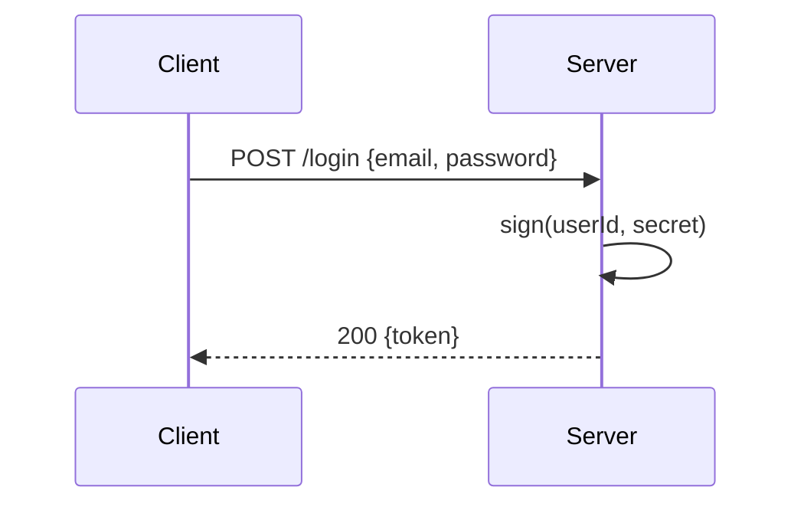
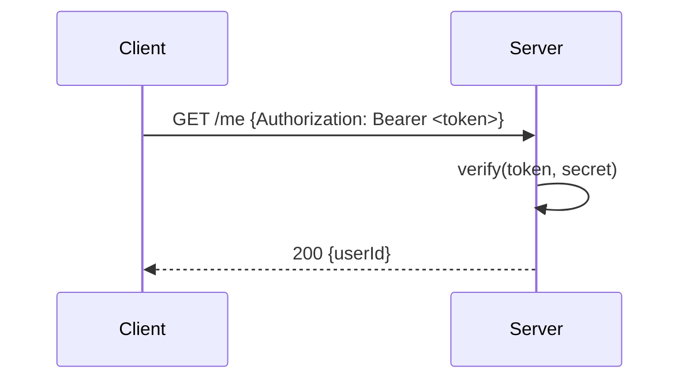

## Business Context

The JWT module is the only cryptographic component in SampleApp. It signs tokens
on login and verifies them on every authenticated request.

## Technical Context

Two functions live in `src/auth/jwt.ts`. The `sign` function occupies lines 3–6
and the `verify` function occupies lines 9–13. Both are relevant to understanding
the security boundary.

**`src/auth/jwt.ts` lines 3–6**
```typescript
export function sign(userId: string, secret: string): string {
  const body = Buffer.from(JSON.stringify({ userId })).toString('base64url');
  const mac = crypto.createHmac('sha256', secret).update(body).digest('base64url');
  return `${body}.${mac}`;
}
```

**`src/auth/jwt.ts` lines 9–13**
```typescript
export function verify(token: string, secret: string): boolean {
  const [body, mac] = token.split('.');
  if (!body || !mac) return false;
  const expected = crypto.createHmac('sha256', secret).update(body).digest('base64url');
  return mac === expected;
}
```

The `OrderViewSet` and `UserProfile` classes are not part of this module.

## Decisions

- HMAC-SHA256 over RS256 to avoid key-pair management in the MVP.

## Diagrams

Flow: token issuance



Flow: token verification


