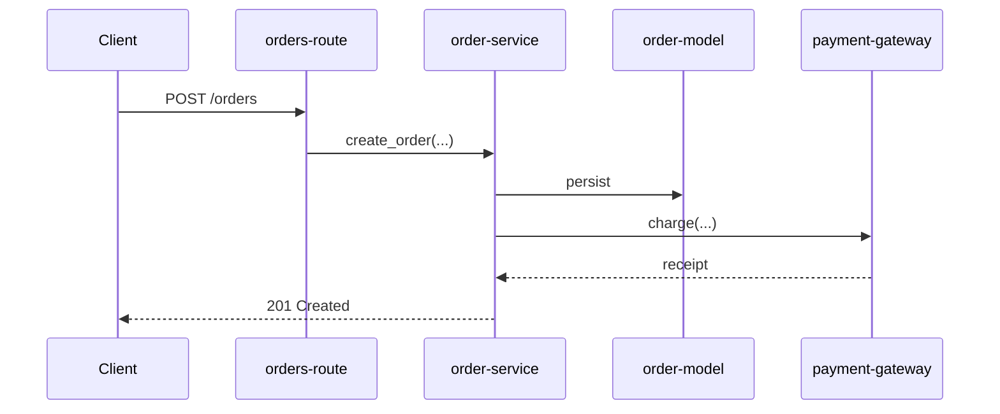

# Data Model: Narrative Navigation & Git-History Risk Surfacing

**Feature**: `006-narrative-git-insight`
**Date**: 2026-05-31

---

## Session/Memory Additions (Part 1)

Captured once at session start, consumed during generation:

| Key | Source | Consumed by |
|---|---|---|
| `generated_at_sha` | `git rev-parse HEAD` | Step 5.3 permalinks; Part 7.1 index write |
| `repo_blob_base` | `git remote get-url origin` → normalised | Step 5.3 snippet permalinks; tribal-knowledge commit links |
| `repo_host_style` | derived (`github` / `gitlab` / `unknown`) | permalink URL shape |
| `tree_dirty` | `git status --porcelain` non-empty | Step 5.3 — disable snippet permalinks if true |
| `git_available` | `git rev-parse HEAD` succeeds | Part 2d + all git consumers — skip if false |

When `git_available` is false: `generated_at_sha`, `repo_blob_base` absent; all git-derived output skipped (FR-009/SC-008).

---

## Git Analysis Result Sets (Part 2d, in memory)

### Churn / Hotspot (per file)
- `path`
- `churn` — commit count touching the file
- `complexity_proxy` — size/length/nesting signal (reused from warning heuristics)
- `is_fragile` — churn high AND complexity above the triviality floor
- `domain(s)` — owning domain(s)

### Ownership (per domain + per file)
- `de_facto_owner` — dominant author by commit count over the domain's files
- `codeowners_owner` — declared owner from `CODEOWNERS` (if present)
- `single_author_files` — files touched by exactly one author (bus-factor-1)

### Tribal-Knowledge (per item)
- `commit_sha7`
- `keyword` — which keyword matched (`revert` / `hotfix` / `workaround` / `don't` / `careful` / `gotcha`)
- `lesson` — one-line summary of the commit message
- `files` / `domain(s)` — touched files and their domains
- deduplicated by (lesson, file); capped per domain (3–5)

---

## New Body Content (rendered in nodes)

### Architecture Overview — Critical-Flow Sequence Diagrams (Step 2a.2b)

In the architecture overview's `## Diagrams` section, 1–3 blocks of:

```
### <Journey name> (e.g., "User Places an Order")
<one-sentence description of the user journey — citation-exempt>


```

- Each diagram crosses ≥ 2 domains; participants labelled with lowercase-hyphen names (§ 2.2).
- ≤ ~8 participants; overflow summarised in the description.
- Omitted entirely if no end-to-end flow is discernible (FR-001).

### Technical Context — TL;DR lead (Step 5.3)

```
## Technical Context

**TL;DR:** <1–2 sentences abstracting the whole section. Not a duplicate of the first detail sentence.>

<detailed paragraphs…>
<inline snippets…>
### Dependencies & Integrations   (feature 005)
### Testing                       (feature 005)
### Related                       (feature 006)
### Ownership                     (feature 006)
```

### Inline-snippet label → permalink (Step 5.3)

When `repo_blob_base` is known, `repo_host_style` supported, and `tree_dirty` is false:

```
**[`<path>` lines N–M](<repo_blob_base>/blob/<sha>/<path>#L<N>-L<M>)**
```
(GitLab style: `<repo_blob_base>/-/blob/<sha>/<path>#L<N>-<M>`.)

Otherwise (no host / unsupported / dirty tree / no SHA), the existing plain label:
```
**`<path>` lines N–M**
```

### `### Related` subsection (Step 5.3)

```
### Related
- [<related node title>](<related-id>.md) — <one-line why related>
```
Built from `dependencies` + `doc_refs`. Omitted if both empty.

### `### Ownership` subsection (Step 5.3)

```
### Ownership
- De facto owner: <author> (<n> commits) (src: inferred from git shortlog)
- Declared owner (CODEOWNERS): <owner>            ← only if CODEOWNERS present
- Single-author files (bus-factor 1): `<path>`, `<path>`
```
Omitted entirely when no git data and no CODEOWNERS (FR-009).

### Warnings additions (Step 3.6 → Step 5.3)

- **Hotspot**: `- Fragile — change carefully: `<path>` (<churn> commits, high complexity) (src: <commit/inferred>)`
- **Tribal-knowledge**: `- <lesson> (src: commit <sha7>)` or, with a host, `- <lesson> ([commit <sha7>](<repo_blob_base>/commit/<sha>))`

Both are inferences → `warnings` stays in `inferred_fields` with its confidence tag (feature 004).

---

## Validation Rule Changes (output-schema.md)

**Rule OP-16 (amended)**: extend the conventional H3 subsection names permitted within `## Technical Context` to: `### Dependencies & Integrations`, `### Testing` (feature 005), `### Related`, `### Ownership` (feature 006). Still advisory; presence/absence does not affect validation; none violate BD-09 (H2-only) or BD-07 (H1).

**No other schema changes.** `schema_version` stays 1. TL;DR, permalinks, critical-flow diagrams, and git-derived warnings are body content within existing sections (`## Technical Context`, `## Diagrams`, `## Warnings`) or the OP-16 H3 subsections.

---

## Citation / Trust Integration (feature 004 compliance)

| New content | Cited? | Notes |
|---|---|---|
| Critical-flow diagram description | No | Lives in `## Diagrams` (exempt, Decision 6) |
| TL;DR | No | Technical Context narrative (exempt) |
| `### Related` links | No | Structural links from frontmatter |
| `### Ownership` notes | Yes (git-derived inference) | `(src: inferred from git shortlog)` / commit |
| Hotspot warnings | Yes | churn factual; "fragile" inferred → cite |
| Tribal-knowledge warnings | Yes | `(src: commit <sha7>)` or commit permalink |
| Snippet permalinks | n/a | The label IS the citation (path + lines + SHA) |

Git-derived `warnings` and `### Ownership` inferences keep `warnings` in `inferred_fields` with a confidence tag; the three-way invariant (`inferred` ⟺ low ⟺ in inferred_fields) is preserved.
